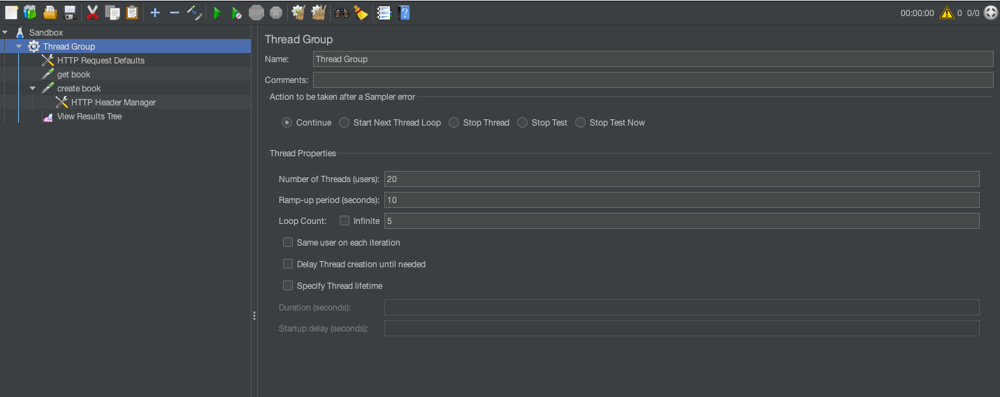
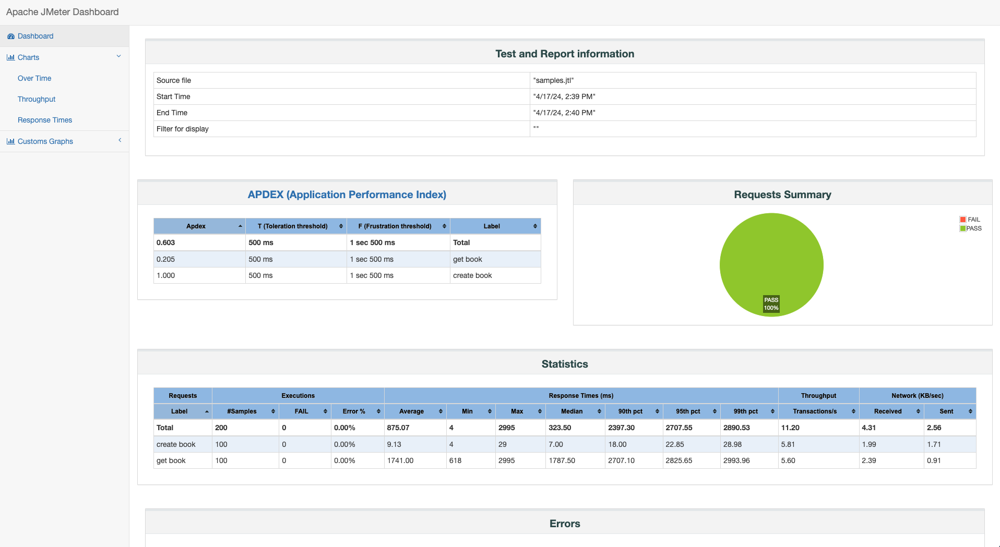
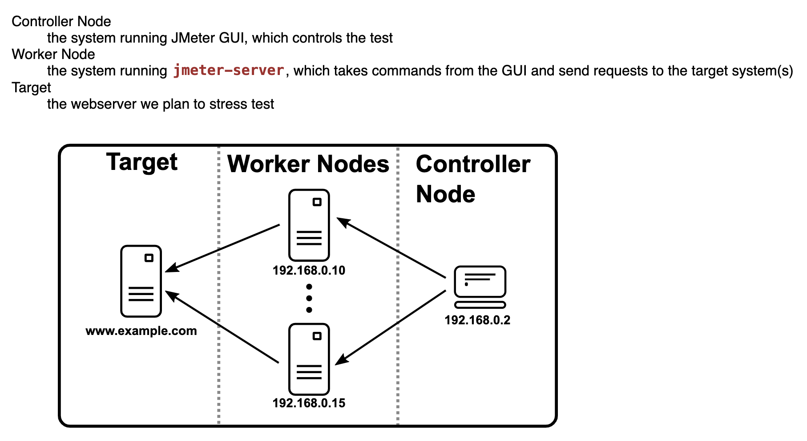

Jmetering
--
### Installation
Jmeter officially provide zip file as installer, download the latest version from [here](https://jmeter.apache.org/download_jmeter.cgi), then unzip the file to somewhere, it should should have folder structures as below:
```commandline
root@MacBook-Pro apache-jmeter-5.6.3 % ls -al
total 104
drwxr-xr-x@  14 biaofu  staff    448 Apr 17 10:10 .
drwxr-xr-x    3 biaofu  staff     96 Apr 16 15:38 ..
-rw-r--r--@   1 biaofu  staff   6148 Apr 16 09:56 .DS_Store
-rw-r--r--@   1 biaofu  staff  17468 Dec 31 10:51 LICENSE
-rw-r--r--@   1 biaofu  staff    172 Dec 31 10:51 NOTICE
-rw-r--r--@   1 biaofu  staff  11046 Jun 29  2023 README.md
drwxr-xr-x   14 biaofu  staff    448 Apr 17 14:39 backups
drwxr-xr-x@  44 biaofu  staff   1408 Apr 16 15:30 bin
drwxr-xr-x@   6 biaofu  staff    192 Jan  2 16:44 docs
drwxr-xr-x@  22 biaofu  staff    704 Dec 31 10:31 extras
-rw-r--r--    1 biaofu  staff   4155 Apr 17 14:01 jmeter.log
drwxr-xr-x@ 146 biaofu  staff   4672 Jan  2 16:42 lib
drwxr-xr-x@  68 biaofu  staff   2176 Dec  6 07:25 licenses
drwxr-xr-x@  20 biaofu  staff    640 Jan  2 16:44 printable_docs
```
The `jmeter` executable file is in the `bin` folder, add the `bin` folder to the $PATH environment, then you can use jmeter anywhere.

### Build test plan
Follow this [guide](https://jmeter.apache.org/usermanual/build-web-test-plan.html) to learn a quick start.
> for sending REST request, do add `HTTP Header Manager` into the request to provide `Content-Type` with `application/json`.



### Run Jmeter test
run below script to start a jmeter test with a test plan and generate HTML report.
```shell
./runplan.sh
```
After run the script, an HTML report will be created at the `report` folder.


### Run test with real time results
Unlike k6, Jmeter natively doesn't have the ability to show real-time result during the testing, the [officially recommended approach](https://jmeter.apache.org/usermanual/realtime-results.html) is add configurations to push samples data to InfluxDB, then you can visualize the real-time results with InfluxDB dashboards, or further integrated with Grafana.

### Distributed test
Jmeter can run distributed tests, follow the below setup, you need to run `jmeter-server` in the work nodes, and run `jmeter` in the control node, detailed configuration can be found at the [official document](https://jmeter.apache.org/usermanual/jmeter_distributed_testing_step_by_step.html).

