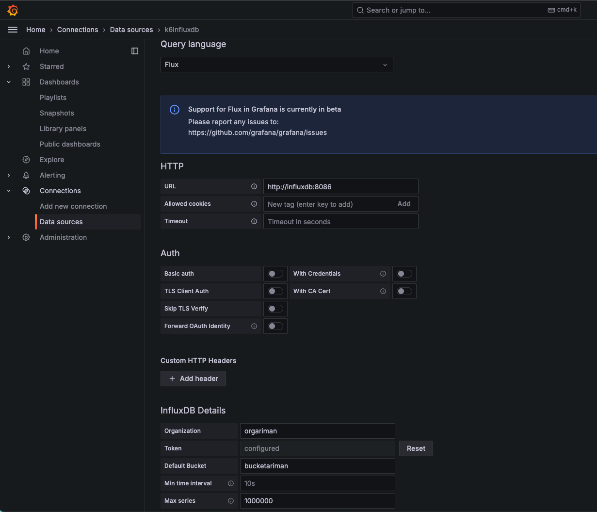

Grafana Visualization
--

We use Grafana to visualize K6 tests results, need to install and configure grafana and influxdb properly.

### Launch Grafana and InfluxDB service
```shell
docker-compose up -d
```

### Configure InfluxDB
Access `http://localhost:8086` and follow the guidance to complete the initialization and collect below information (with example value):
- username: ariman
- password: password1
- organization: orgariman
- bucket: bucketariman
- token: BLR7a7CT6rtnyMvU9MJJkP728wxvtKbCadbbmipuydQd959iZP9YC5-Xsz_5dziqBnKElkoOj_nCYZQlvWmsyw==

### Configure Grafana
Access `http://localhost:3303` with default credential `admin/admin`, change the password to a new one, e.g. `password1`.

#### Add datasource
Go to Connections -> Data sources to add data source with InfluxDB.
Configure the data source with below information (just for example):
- name: k6influxdb
- query language: flux
- http url: http://influxdb:8086 (use the name of influx service defined in the docker-compose file)
- Auth - basic auth: off
- InfluxDB details - Organization: orgariman
- InfluxDB details - Token: BLR7a7CT6rtnyMvU9MJJkP728wxvtKbCadbbmipuydQd959iZP9YC5-Xsz_5dziqBnKElkoOj_nCYZQlvWmsyw==
- InfluxDB details - Default Bucket: bucketariman
- InfluxDB details - Max series: 1000000



#### Create dashboard

##### create `folder` for better management.
Go to Dashboards -> New -> New folder to add a new folder `k6riman`.

##### add dashboard
Get into the `k6riman` folder and create dashboard by importing a specific JSON file in the `dashboards` folder in this repo,
e.g. `k6riman-grafana.dashboard.json`


